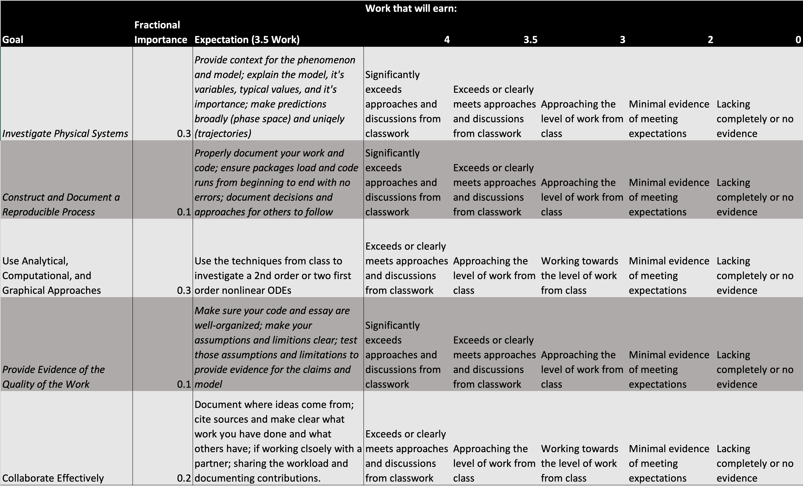

# Project 2

Project 2 will expand on what you have done in Project 1 to include more dimensions or multi-body systems. In this project you will:

1. develop a model of a physical system of either: (1) 3 dimensional phase space or (2) two or more bodies,
2. for (1), you will repeat most of the work donein project 1 with additional dimensionality; for (2) use a Lagrangian analysis to establish your equations of motion and investigations
3. develop a similar analysis to project 1 (phase space, plots, numerical integration, etc)

## What do you need to do?

Develop a computational essay that investigates the physics of your system of interst. You have the tools at your disposal, so the emphasis will be on what you have learned about the physics of the system. This means telling stories about the energy, momentum, angular momentum, etc of your system as you investigate it. Relating your analyses to any foundational or fundamental principles that are appropriate. The key is that we should be able to read your notebook and follow precisely what you wanted to do.

## Rubric

Our rubric will be the same as project 1, but we will be look more closely at the physics discussions to score your modeling and communication elements higher.

**Right click and open in new tab for large version**

